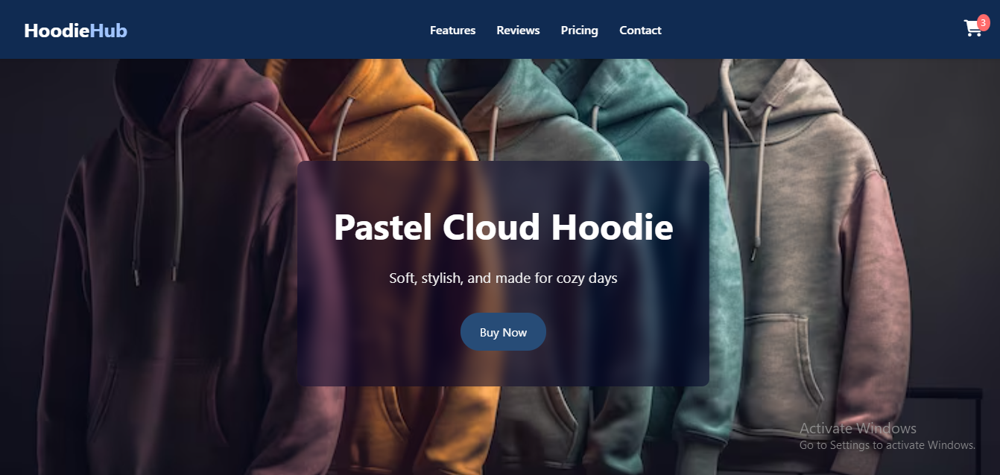
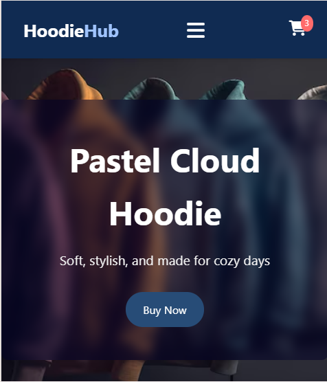

🧥 Hoodie Product Landing Page

Welcome to the Hoodie Product Landing Page  a modern, clean, and responsive landing page built with HTML, CSS, and vanilla JavaScript. This project is created as part of a front-end internship task to showcase product layout, interactivity, and responsive design.

---

 🚀 Features

-  Responsive design (mobile, tablet, desktop)
-  Hero section with background image and transparent overlay
-  Product feature cards with image, price, and Add to Cart button
-  Interactive shopping cart with item count, total price, and remove option
-  Hamburger menu (mobile navigation)
-  Scroll-to-top button
-  Contact form with success alert
-  Smooth user experience using Flexbox/Grid & animations

---

💻 Tech Stack

- HTML5 – Semantic markup
- CSS3 – Custom styles with responsive design
- JavaScript (Vanilla) – Cart functionality & UI interactivity

---

📸 Screenshots

 💻 Desktop View

 📱 Mobile View

---

🧪 Features in Action

- Add any hoodie to the cart and see it update in real time
- Remove items and see totals adjust dynamically
- Works great on all screen sizes
- Mobile nav toggles with hamburger icon
- Scroll-to-top appears after scrolling

---

✍️ Author

Made by Wishma Noor 
> Front-end Developer Intern

- GitHub: (https://github.com/wishmanoor123/Product-Landing-Page))

---

 📄 License

This project is licensed under the MIT License free for personal and commercial use.

